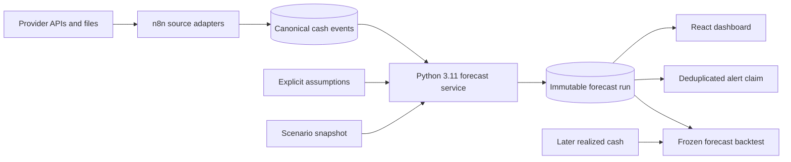

# Architecture

This is the single authoritative architecture document. It describes the implemented reference system, not an observed production deployment.

## Ownership boundaries

- **n8n:** schedules, webhooks, provider mapping, service invocation and notification transport.
- **Python service:** validation, freshness policy, duplicate policy, currency conversion, recurrence, forecast/scenario calculation, fingerprints, runway and backtest metrics.
- **PostgreSQL:** canonical data, immutable run provenance, idempotent result persistence, daily projections, alert state and backtest records.
- **React:** reads persisted results and displays their as-of date and evidence label; it does not calculate forecasts.

Every run persists its `as_of_date`, source watermark, full assumptions, assumption fingerprint, scenario snapshot and model version. A later backtest compares realized observations to that frozen result rather than regenerating history with new information.

## Deliberate gaps

The provider adapters and aggregation workflow retain mapping code because each provider contract needs integration-specific validation. Production deployment also needs a chosen tenant authorization model, RLS policies, platform credentials, notification delivery and authenticated end-to-end provider tests. Those gaps are documented rather than represented as completed.
