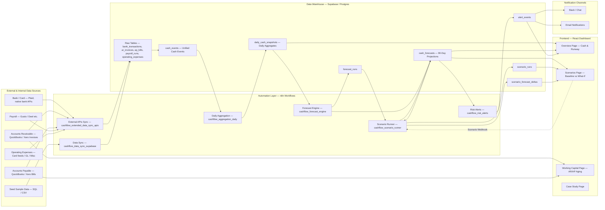

```mermaid
flowchart LR

    subgraph Sources[External & Internal Data Sources]
        Bnk[Bank / Card — Plaid, native bank APIs]
        AR[Accounts Receivable — QuickBooks / Xero Invoices]
        AP[Accounts Payable — QuickBooks / Xero Bills]
        Pay[Payroll — Gusto / Deel etc.]
        Opex[Operating Expenses — Card feeds / GL / Misc]
        Seed[Seed Sample Data — SQL / CSV]
    end

    subgraph n8n[Automation Layer — n8n Workflows]
        direction TB
        DS[Data Sync — cashflow_data_sync_supabase]
        EXT[External APIs Sync — cashflow_extended_data_sync_apis]
        AGG[Daily Aggregation — cashflow_aggregation_daily]
        FCAST[Forecast Engine — cashflow_forecast_engine]
        SCEN[Scenario Runner — cashflow_scenario_runner]
        ALERT[Risk Alerts — cashflow_risk_alerts]
    end

    subgraph DB[Data Warehouse — Supabase / Postgres]
        direction TB
        RAW[Raw Tables — bank_transactions, ar_invoices, ap_bills, payroll_runs, operating_expenses]
        EVENTS[cash_events — Unified Cash Events]
        SNAP[daily_cash_snapshots — Daily Aggregates]
        FRUNS[forecast_runs]
        FCASTS[cash_forecasts — 90-Day Projections]
        SCENRUN[scenario_runs]
        SCENDELTA[scenario_forecast_deltas]
        ALERTS[alert_events]
    end

    subgraph UI[Frontend — React Dashboard]
        direction TB
        OVW[Overview Page — Cash & Runway]
        SCENUI[Scenarios Page — Baseline vs What-If]
        WCUI[Working Capital Page — AR/AP Aging]
        CSUI[Case Study Page]
    end

    subgraph Alerts[Notification Channels]
        Slack[Slack / Chat]
        Email[Email Notifications]
    end

    %% Sources to n8n
    Bnk --> EXT
    AR --> EXT
    AP --> EXT
    Pay --> EXT
    Opex --> EXT
    Seed --> DS

    %% n8n to DB
    EXT --> RAW
    DS --> RAW
    RAW --> EVENTS
    AGG --> SNAP
    FCAST --> FRUNS
    FCAST --> FCASTS
    SCEN --> SCENRUN
    SCEN --> FCASTS
    SCEN --> SCENDELTA
    ALERT --> ALERTS

    %% DB to n8n (read side)
    EVENTS --> AGG
    SNAP --> FCAST
    FRUNS --> SCEN
    FCASTS --> SCEN
    FCASTS --> ALERT

    %% DB to UI
    SNAP --> OVW
    FCASTS --> OVW
    FCASTS --> SCENUI
    SCENRUN --> SCENUI
    SCENDELTA --> SCENUI
    AR --> WCUI
    AP --> WCUI
    ALERTS --> OVW

    %% Alerts out
    ALERTS --> Slack
    ALERTS --> Email

    %% UI interaction to n8n
    SCENUI -. Scenario Webhook .-> SCEN
```
